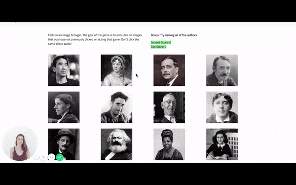

## React.js Memory Game

This is a memory card game built using React. This project was bootstrapped with [Create React App](https://github.com/facebookincubator/create-react-app). Users click on one of the 12 images, and attempt to click as many images in a row as they can without clicking on the same image twice. Their top score is recorded and the game restarts if they click on the same image twice within a given game. 

This application is meant to demonstrate my ability to set and use state to track changing pieces of the game. It's also meant to show use of components. For this application, I opted to use classes over functions since I was able to incorporate a lot more of the logic that way in an organization manner that made sense to me. Opting to use fewer components, I was able to section the code into two primary portions - display and logic. 

The main app component displays data that will not be altered within the app. Within this component, the authors component is rendered. The authors component houses the authors array of objects (which could alternatively be stored in a json file). It also stores displayed portions that are modified as the user plays, such as current score, top score for that session, and moving cards. In this, the dynamic parts of the app are all kept together and easily modifiable through state. 

[Use the application here](https://falondarville.github.io/memory-game/)

## Technologies and Methods Used

React, JavaScript, HTML/CSS, game logic

## Challenges and Learning Summary

I previously taught myself React but had not dealt with incorporating game logic into an application. I decided to keep the application simple since it's not robust, so created one component which houses the card data, game logic, and score keeping. The main app component renders the game logic component. 

When I was teaching myself React, I dove straight into working with an Express server with it. So this project was backtracking a bit and working strictly with React. React runs its own small server, which automatically renders changes to the screen, making it very easy to develop with. It's a very smart technology that I really enjoy using. 

Overall, the most difficult part for me was writing the logic to determine which cards had previously been clicked. I started off by adding a clicked boolean value to the image objects. However, after speaking to a classmate, determined that this was not the most seamless and simple way to program the logic. Instead, I refactored the code so that images that had previously been clicked on would be moved to an array in state, and the array was emptied each time the game was reset. This method works for this scale of an application and keeps the code trim and tidy. 

My goal throughout working with these projects is to keep it simple. I want others to be able to look at my code and know what's going on. Overcomplicating code makes it not only harder on the developer herself, but also on others who could be touching the code later on. 
